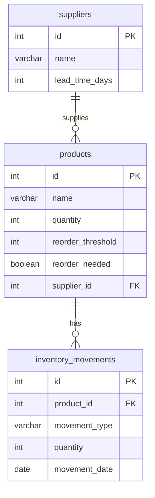

# 📦 Inventory & Supply Chain Tracking

[](https://www.postgresql.org/)
[](https://powerbi.microsoft.com/)
[](LICENSE)

A data-driven inventory management solution that tracks stock movement, automates reorder alerts, and analyzes supplier performance using PostgreSQL and Power BI.

---



---

## 📌 Features

| Feature                         | Description                                                              |
|--------------------------------|--------------------------------------------------------------------------|
| 🔄 **Stock Movement Tracking** | Daily tracking of inventory IN/OUT with summary views                    |
| 🚨 **Reorder Alerts**          | Auto-flags products needing restock using SQL triggers                   |
| 📊 **Supplier Insights**       | Lead time analysis and reorder impact reports per supplier               |
| 🧾 **Power BI Dashboard**      | Interactive visuals for inventory levels, trends, and vendor analytics   |
| 🧠 **DAX Measures**            | Inventory Gap, Total IN/OUT, Reorder KPIs                                |
| 🧪 **Sample Dataset**          | Preloaded data for demo, testing, and reporting                          |

---

## 🧱 Schema Overview

```dbml
Table products {
  id int [pk]
  name varchar
  quantity int
  reorder_threshold int
  reorder_needed boolean
  supplier_id int [ref: > suppliers.id]
}

Table inventory_movements {
  id int [pk]
  product_id int [ref: > products.id]
  movement_type varchar
  quantity int
  movement_date date
}

Table suppliers {
  id int [pk]
  name varchar
  lead_time_days int
}
```

---

## 🚀 Setup Instructions
1. Clone the Repository
```bash
git clone https://github.com/your-username/inventory-supplychain-tracker.git
cd inventory-supplychain-tracker
```
2. Run PostgreSQL via Docker
```bash
docker run --name postgres-db \
  -e POSTGRES_PASSWORD=postgres \
  -e POSTGRES_DB=inventory_tracker \
  -p 5432:5432 \
  -d postgres
```
3. Load Schema & Sample Data
```bash
psql -U postgres -d inventory_tracker -f sql/create_tables.sql
psql -U postgres -d inventory_tracker -f sql/insert_sample_data.sql
psql -U postgres -d inventory_tracker -f sql/create_views.sql
psql -U postgres -d inventory_tracker -f sql/triggers.sql
```

---

## 📁 Project Structure
```pgsql
inventory-supplychain-tracker/
│
├── sql/                       # All SQL setup scripts
│   ├── create_tables.sql
│   ├── insert_sample_data.sql
│   ├── create_views.sql
│   └── triggers.sql
│
├── InventoryTrackerDashboard.pbix  # Power BI report file
├── README.md
├── .gitignore
└── LICENSE
```

---

## 📚 DAX Measures

```
Total Stock In = SUM(daily_inventory_summary[total_stock_in])

Total Stock Out = SUM(daily_inventory_summary[total_stock_out])

Inventory Gap = SUM(products[reorder_threshold]) - SUM(products[quantity])

Reorder Product Count = 
COALESCE(CALCULATE(COUNTROWS(products), products[reorder_needed] = TRUE()), 0)

Reorder Product Count by Supplier = 
CALCULATE(COUNTROWS(products), products[reorder_needed] = TRUE())
```

---

## 💡 Future Enhancements
* ✅ Add Slack or email alerts when stock drops

* ✅ Automate data refresh via cron or Power BI Gateway

* 📦 Connect to real ERP/Inventory data source

* 📬 REST API to post inventory updates

* 📈 Publish to Power BI Service for mobile access

---

👤 Author
Daniel Acevedo
💼 Data Engineer | 🔗 [linkedin.com/in/dacevedo](https://www.linkedin.com/in/dacevedo)
📧 dacevedo86@yahoo.com
📍 Fort Worth, TX
🌐 GitHub: [@poloman2308](https://www.github.com/poloman2308)
